# The Segmentation View {#org_mitk_views_segmentation}

[TOC]

## Overview {#org_mitk_views_segmentationoverview}

Segmentation is the act of separating an image into foreground and background subsets by manual or automated delineation, while the foreground is defined to be part of the segmentation.
Such a segmented image subset is also called a label as it typically labels a specific region of interest.
A multilabel segmentation may contain multiple labels organized in distinct groups.
You can create multiple labels for different regions of interest contained within a single segmentation image.
Labels in the same group cannot overlap each other but labels from different groups may overlap.

The MITK **Segmentation Plugin** allows you to create multilabel segmentations of anatomical and pathological structures in medical images.
The plugin consists of three views:

- **Segmentation View**: Manual and (semi-)automatic segmentation
- [Segmentation Utilities](@ref org_mitk_views_segmentationutilities): Post-processing of segmentations
- [Segmentation Task List](@ref org_mitk_views_segmentationtasklist): Optimized workflow for batches of segmentation tasks based on a user-defined task list

In this user guide, the features of the **Segmentation View** are described.
For an introduction to the Segmentation Utilities or Segmentation Task List, refer to the respective user guides.

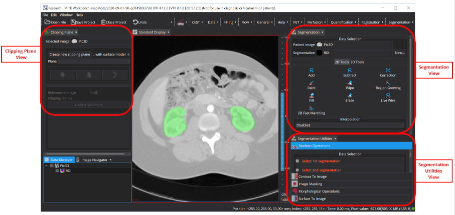

## Quick Reference {#org_mitk_views_segmentationquickreference}

### Keyboard Shortcuts & Tips

| **Category** | **Action** | **Shortcut / Method** |
|--------------|------------|----------------------|
| **Preferences** | Open preferences | `Ctrl+P` |
| **Label Management** | Add new label to active group| `Ctrl+L` `Ctrl+A` |
|  | Add new label instance of active label | `Ctrl+L` `Ctrl+I` |
|  | Delete active label instance | `Ctrl+L` `Ctrl+D` |
|  | Toggle active label visibility | `Ctrl+H` |
|  | Toggle to next label as active label | `Ctrl+L` `Ctrl+N` |
| **Label Renaming** | Rename label | `Ctrl+L` `Ctrl+R` |
|  | Rename label (alternative) | `Alt+Double-Click` label |
|  | Quick select suggestion in the Name/Rename dialog| `Double-click` suggestion |
| **Label Navigation** | Select and center on label | `Double-click` label |
|  | Highlight label in views | `Hover` over label |
|  | Show invisible labels | `Shift+Hover` |
| **Tool Modifiers** | Invert tool behavior (Add↔Subtract, Paint↔Wipe)| `Ctrl+Draw` |
| **Lasso Tool** | Start/end segmentation | `Double left-click` |
|  | Add anchor point | `Ctrl+Left-Click` |
|  | Delete anchor point | `Del` (when selected) |
|  | Move anchor point | `Click+Drag` anchor |
| **Region Growing** | Widen/narrow gray value range | Mouse Up/Down while drawing |
|  | Shift gray value range | Mouse Left/Right while drawing |
| **Selection Tool** | Show label info popup | `Hover` over label |
|  | Select topmost label | `Left-Click` |
| **AI Tools (SAM/MedSAM)** | Positive click | `Shift+Left-Click` |
|  | Negative click (adjust mask) | `Shift+Right-Click` |

### Important Behaviors

| **Feature** | **Behavior** |
|-------------|-------------|
| **Locked labels** | Act as "cookie cutters" - prevent override within same group |
| **Group overlap** | Labels from different groups can overlap (not overriding each other) |
| **Tool crosshair** | Crosshair movement is disabled when manual tools are active |
| **Close tool** | Uses region's label, not necessarily the active label |
| **Fill/Erase tools** | Only work on unlocked labels or active label regions |
| **Preset loading** | Label presets do not remove labels that are not affected by them. Also it never removes pixel content (except when moving to different group) |

## Image and segmentation prerequisites {#org_mitk_views_segmentationtechnicalissues}

The Segmentation View has a few prerequisites regarding segmentations and their reference image:

- Images must be two or three-dimensional and may be either static or dynamic, e.g., are time-resolved resp. have different pixel values for different time steps.
- Images must be single-valued, i.e. CT, MRI or ultrasound. Images from color doppler or photographic (RGB) images are only partially supported (please be aware that some tools might not be compatible with this image type).
- Segmentations must be congruent to their reference images, e.g., their voxel grids must match.

## Image selection and creating new segmentations {#org_mitk_views_segmentationdataselection}

The view automatically selects a reference image from the Data Manager if one is available. If you have multiple images loaded, verify that the correct one is selected in the *Image* widget at the top of the Data selection section.

Once a reference image is selected, the view automatically selects a matching segmentation if available. When no segmentation exists, only a "Create new segmentation" button is displayed.

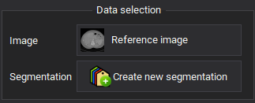

Click this button to create a new multilabel segmentation with an initial, empty label (unless configured otherwise in preferences). The new segmentation is added to the Data Manager as a child node of its reference image and is automatically selected for editing.

If multiple segmentations exist for the reference image, verify the correct one is selected. You can change the selection by clicking the *Segmentation* widget, or create an additional segmentation by clicking the collapsed "Create new segmentation" button next to the segmentation selector.

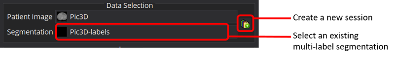

## Groups {#org_mitk_views_segmentationgroups}

Segmentation images consist of at least a single group called "Group 0" in which the first default label is created.
More groups can be added and removed but there will always be at least a single group.
Labels of the same group cannot overlap each other.
Labels of different groups may overlap each other.

For example, you could segment the whole heart as "Heart" label in "Group 0", add "Group 1" and create multiple labels of the anatomical details of the heart in that group.
Naturally, all these labels lie within the extents of the "Heart" label of "Group 0" but in principle they are completely independent of "Group 0".
Some pixels are now labelled twice, e.g., as "Heart" and "Left ventricle".
Since the labels of "Group 1" cannot overlap each other, it is impossible to accidentally label a pixel as both "Left ventricle" and "Right ventricle".

If you would like to segment even more details you could create "Group 2" to have up to three labels per pixel.
Nevertheless, groups are technically a flat data structure and cannot contain nested groups.
It is all about possibly overlapping labels from distinct groups and spatially exclusive, non-overlapping labels within the same group.

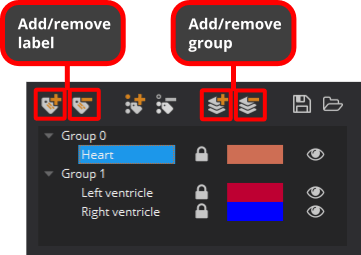

## Labels vs. label instances {#org_mitk_views_segmentationlabelinstances}

The Segmentation View supports label instances.
That is, segmenting multiple distributed entities of the same thing like metastases for example.

A label, as we used the term before, is already a single instance of itself but it may consist of multiple label instances.

If a label consists of multiple label instances, they each show their own distinct pixel value in square brackets as a clue for distinction and identification.

It is important to understand that this number is not a separate, consecutive index for each label.
It is just the plain pixel value of the label instance, which is unique across all label instances of the whole segmentation.

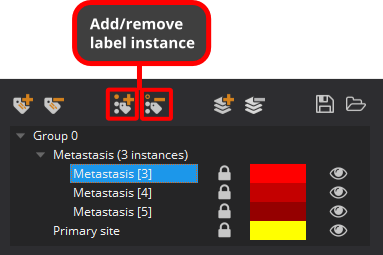

## Unlocking, changing color of, and hiding label instances {#org_mitk_views_segmentationlock_color_visibility}

Label instances are locked by default: label instances from the same group cannot accidentally override pixels from other label instances.
Locked label instances behave like cookie cutters for other label instances of the same group.
You can unlock label instances to remove that protection from other label instances of the same group.
Their pixel contents can then be overridden by other label instances of the same group.

Remember that label instances from distinct groups do not interact with each other.
They can always overlap (not override) each other.

You can also change the color of label instances as well as show (default) or hide their pixel contents.
The icons at the right side of the rows of the groups and labels widget reflect their state in all these regards.

Renaming of labels and label instances can be found in their content menu as shown further below.

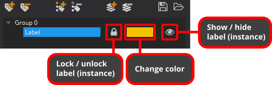

## Label highlighting {#org_mitk_views_segmentationlabelhighlighting}

Especially if you have segmentations with many label instances or the label names are not telling, it can be nontrivial to match the pixel content of a label with its entry in the list of labels (called label inspector) in the Segmentation plugin. To mitigate this problem, MITK uses label highlighting. As long as you hover with the mouse cursor over a group, label or label instance in the segmentation plugin, the pixels of the respective label instances will be highlighted. Highlighted labels will visually pop out by being shown with full opacity (no transparency) while the opacity of all non-highlighted labels of the same segmentation will be reduced, e.g., they become more transparent.

By default, label instances that are set to be invisible are not shown while highlighted. By pressing the shift key, one can enforce also invisible label instances to be shown while highlighting.

**Remark:** The highlighting is supported in all views that use the label inspector (e.g. also the segmentation utilities).

**Hint:** You can also use the [Selection tool] to highlight labels by hovering over their pixels with the mouse cursor.

## Context menus {#org_mitk_views_segmentationcontextmenus}

Actions for organization of groups, labels, and label instances (as well as other operations) can be also found in their right-click context menus.

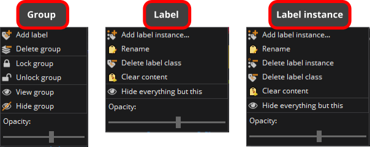

Most actions available in these context menus are self-explanatory or were already described above by other means of access like the tool button bar for adding and removing groups, labels, and label instances.

Note that renaming a label instance will make a separate label out of it, since all instances of the same label share a single common name.

**Clear content** only clears the pixels of a label instance but won't delete the actual label instance.

Groups can be **locked** and **unlocked** as a whole from their context menu, while label instances can be directly locked and unlocked outside the context menu as described further below.

## Label search bar {#org_mitk_views_segmentationlabelsearchbar}

The label search bar is located directly below the list of labels and provides quick access to label instances.

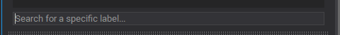

Type any substring into the search field to display a dropdown list showing all label instances containing that text. You can then:

- Press **Return** to select the first label instance in the list
- Use **arrow keys** to navigate the list before pressing Return
- Click on any entry with the **mouse** to select it directly

When a label instance is selected from the search results, it becomes active and the views center on the label's pixel content (equivalent to double-clicking a label).

## Label name and color suggestions {#org_mitk_views_segmentationlabelsuggestions}

### Renaming and naming labels {#org_mitk_views_segmentationlabelsuggestions_ux}

When renaming a label (via CTRL+L CTRL+R, label context menu, or ALT+double left-click on a label instance) or creating a new label with enforced name suggestions in the preferences, a name dialog appears.

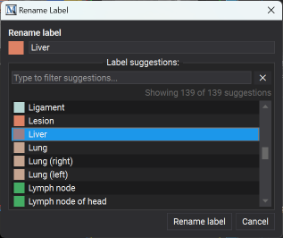

The dialog displays the current color and name of the label. Its behavior depends on whether name suggestions are enforced in the preferences:

**Enforced suggestions mode:**
- You must select a name from the suggestion list; direct name and color editing is disabled
- Use the filter field in the Label suggestion box to search for specific suggestions

**Non-enforced mode:**
- Type the label name directly and click on the color to change it
- Optionally enable **Auto-filter suggestions** to filter the suggestion list based on the current name input
- If auto-filter is disabled, use the filter field in the Label suggestion box to search suggestions

**Hint:** Double-click any suggestion to select it and automatically close the dialog.

### Label suggestion file format {#org_mitk_views_segmentationlabelsuggestions_format}

Label name and color suggestions are stored in a special version of the MITK Stacked Segmentation Format (JSON). The custom suggestion list must contain an array of objects, each with a mandatory "name" string and an optional "color" string. In addition, suggestions can also define additional information that should be associated with the label as well as the maximum number of instance occurrences allowed (unique, unlimited, max number).

You can configure which suggestion file to use and how suggestions are handled in the preferences (Ctrl+P) > Segmentation. For detailed information about the MITK Stacked Segmentation Format, refer to the format specification.

Since suggestions use the same format as segmentations stored in the MITK Stacked Segmentation format, you may use those as suggestions for other segmentations as well, if desired.

## Saving and loading label set presets {#org_mitk_views_segmentationlabelpresets}

Label set presets are useful to share a certain style or scheme between different segmentation sessions or to provide templates for new segmentation sessions.

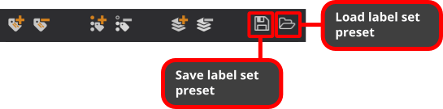

### Creating and applying presets

The properties of all label instances in all groups like their names, colors, and visibilities are saved as a label set preset by clicking on the 'Save label set preset' button.
Label set presets are applied to any segmentation session by clicking on the 'Load label set preset' button.

### Preset behavior

When loading a preset onto an existing segmentation:
- Label instances **not defined in the preset** remain unchanged - they are neither removed nor modified
- Label instances **defined in the preset** are added, if they don't exist, or have their properties updated otherwise (name, color, visibility)
- The **pixel contents** of any label **remain untouched** (see exception below)
- **Exception:** If a label is moved to a different group by the preset, the old label's pixel content will be removed

### File format and compatibility

Label set presets are stored in a version of the MITK Stacked Segmentation Format (JSON). For detailed information about this format, refer to the respective in-depth documentation.

Since presets use the same format as segmentations stored in the MITK Stacked Segmentation format, you may use those as a preset for other segmentations as well, if desired.

### Default preset

If you work on a repetitive segmentation task, manually loading the same label set preset for each and every new segmentation can be tedious.
To streamline your workflow, you can set a default label set preset in the Segmentation preferences (Ctrl+P). When set, this label set preset will be applied to all new segmentations instead of creating the default red "Label 1" label instance.

## Preferences {#org_mitk_views_segmentationpreferences}

The Segmentation Plugin offers a number of preferences which can be set via the MITK Workbench application preferences (Ctrl+P):

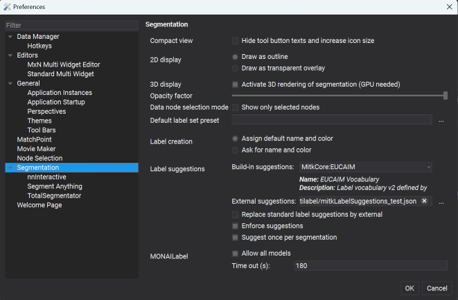

### Display options

- **Compact view:** Hide tool button texts and increase icon size to save screen space
- **2D display:** Choose between drawing segmentations as outlines or transparent overlays
- **Opacity factor:** Adjust the transparency of segmentation overlays (slider from 0-100%)
- **3D display:** Activate 3D rendering of segmentations (requires GPU)
- **Data node selection mode:** Show only selected nodes - ensures only the selected segmentation and its reference image are visible

**Note:** To control 3D rendering for individual segmentations, right-click the segmentation in the Data Manager and toggle the **3D visualization** entry in the context menu.

### Label management

- **Default label set preset:** Specify a label set preset file to use for all new segmentations instead of creating a default label
- **Label creation:** Choose between automatically assigning default names and colors, or being prompted to specify name and color for each new label

### Label suggestions

- **Built-in suggestions:** Select from available built-in label suggestion sets
- **External suggestions:** Specify a custom label suggestions file (JSON format)
- **Replace standard label suggestions by external:** When checked, external suggestions replace built-in ones; when unchecked, they are combined
- **Enforce suggestions:** Require label names to be valid suggestions - custom label names are not allowed
- **Suggest once per segmentation:** Each suggestion is only offered once per segmentation to avoid duplicate labels. If this is active, occurrence constraints defined by the suggestions are ignored.

### MONAI Label settings

- **Allow all models:** Show all available MONAI Label models (when unchecked, only compatible models are shown)
- **Time out (s):** Set the timeout duration in seconds for MONAI Label server requests (default: 180)

## Segmentation tool overview {#org_mitk_views_segmentationtooloverview}

MITK offers a comprehensive set of slice-based 2D and (semi-)automated 3D segmentation tools.
The manual 2D tools require some user interaction and can only be applied to a single image slice whereas the 3D tools operate on the whole image.
The 3D tools usually only require a small amount of user interaction, i.e. placing seed points or setting / adjusting parameters.
You can switch between the different toolsets by selecting the 2D or 3D tab in the segmentation view.

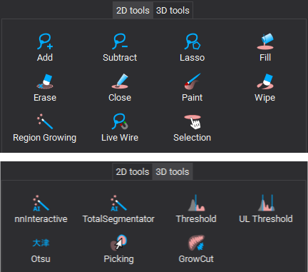

## 2D segmentation tools {#org_mitk_views_segmentation2dsegmentation}

With 2D manual contouring you define which voxels are part of the segmentation and which are not. This allows you to create segmentations of any structures of interest in an image.
You can also use manual contouring to correct segmentations that result from sub-optimal automatic methods.
The drawback of manual contouring is that you might need to define contours on many 2D slices. However, this is mitigated by the interpolation feature, which will make suggestions for a segmentation.

To start using one of the editing tools, click its button from the displayed toolbox.
The selected editing tool will be active and its corresponding button will stay pressed until you click the button again.
Selecting a different tool also deactivates the previous one.

If you have to delineate a lot of images, shortcuts to switch between tools becomes convenient.
For that, just hit the first letter of each tool to activate it (A for Add, S for Subtract, etc.).

All of the editing tools work by the same principle: using the mouse (left button) to click anywhere in a 2D window (any of the orientations axial, sagittal, or coronal),
moving the mouse while holding the mouse button and releasing the button to finish the editing action.
Multi-step undo and redo is fully supported by all editing tools by using the application-wide undo / redo buttons in the toolbar.

*Remark:* Clicking and moving the mouse in any of the 2D render windows will move the crosshair that defines what part of the image is displayed.
This behavior is disabled as long as any of the manual segmentation tools are active - otherwise you might have a hard time concentrating on the contour you are drawing.

### Add and subtract tools {#org_mitk_views_segmentationaddsubtracttools}

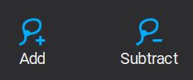

Use the left mouse button to draw a closed contour. When releasing the mouse button, the contour will be added (Add tool) to or removed (Subtract tool) from the current segmentation.
Adding and subtracting voxels can be iteratively repeated for the same segmentation. Holding CTRL / CMD while drawing will invert the current tool's behavior (i.e. instead of adding voxels, they will be subtracted).

| **Category** | **Action** | **Shortcut** |
|--------------|------------|----------------------|
| **Tool Modifiers** | Invert tool behavior (Add↔Subtract, Paint↔Wipe)| `Ctrl+Draw` |

### Lasso tool {#org_mitk_views_segmentationlassotool}

The tool is a more advanced version of the add/subtract tool. It offers you the following features:

1. Generating a polygon segmentation (click left mouse button to set anchor point)
2. Freehand contouring (like the add tool; press left mouse button while moving the mouse)
3. Move anchor points (select an anchor point, press left mouse button while moving the mouse)
4. Add new anchor points (press CTRL while click left mouse to add an anchor to the contour)
5. Delete an anchor point (press Del while ancor point is selected)
6. Segmentation can be added to the label (Add mode) or subtracted (Subtract mode)

To start a segmentation double left click where the first ancor point should be. To end the segmentation double left click where the last ancor point should be.
Please note that:

- Features 3-6 are only available, if auto confirm is *not* activated
- Features 3-5 are not available for freehand contour segments

| **Category** | **Action** | **Shortcut** |
|--------------|------------|----------------------|
| **Lasso Tool** | Start/end segmentation | `Double left-click` |
|  | Add anchor point | `Ctrl+Left-Click` |
|  | Delete anchor point | `Del` (when selected) |
|  | Move anchor point | `Click+Drag` anchor |

### Paint and wipe tools {#org_mitk_views_segmentationpaintwipetools}

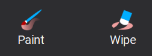

Use the *Size* slider to change the radius of the round paintbrush tool. Move the mouse in any 2D window and press the left button to draw or erase pixels.
Holding CTRL / CMD while drawing will invert the current tool's behavior (i.e. instead of painting voxels, they will be wiped).

| **Category** | **Action** | **Shortcut** |
|--------------|------------|----------------------|
| **Tool Modifiers** | Invert tool behavior (Add↔Subtract, Paint↔Wipe)| `Ctrl+Draw` |

### Region growing tool {#org_mitk_views_segmentationregiongrowingtool}

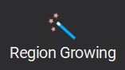

Click at one point in a 2D slice widget to add an image region to the segmentation with the region growing tool.
Region Growing selects all pixels around the mouse cursor that have a similar gray value as the pixel below the mouse cursor.
This allows to quickly create segmentations of structures that have a good contrast to surrounding tissue.
The tool operates based on the current level window, so changing the level window to optimize the contrast for the ROI is encouraged.
Moving the mouse up / down is different from left / right:
Moving up the cursor while holding the left mouse button widens the range for the included grey values; moving it down narrows it.
Moving the mouse left and right will shift the range.
The tool will select more or less pixels, corresponding to the changing gray value range.

| **Category** | **Action** | **Shortcut** |
|--------------|------------|----------------------|
| **Region Growing** | Widen/narrow gray value range | Mouse Up/Down while drawing |
|  | Shift gray value range | Mouse Left/Right while drawing |

### Fill tool {#org_mitk_views_segmentationfilltool}

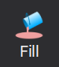

Left-click inside a region/segmentation to flood fill all connected pixels that have the same label with the active label. This tool will only work on regions of unlocked labels or on regions that are not labeled at all.

### Erase tool {#org_mitk_views_segmentationerasetool}

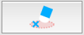

This tool removes a connected part of pixels that form a segmentation. You may use it to remove single segmented regions by left-click on specific segmentation region.
This tool will only work and regions of unlocked labels or on regions of the active label.

### Close tool {#org_mitk_views_segmentationclosetool}

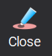

Left-click inside the region/segmentation to fill all "holes" (pixels labelled with another label or no label) inside the region.
Therefore this tool behaves like a local closing operation. This tool will not work, when a non-labeled region is selected and holes of locked labels will not be filled.

**Remark:** This tool always uses the label of the selected region (even if this label is not the active label). Therefore you can use this tool on regions of the active label and of none locked labels (without the need to change the active label).

### Live wire tool {#org_mitk_views_segmentationlivewiretool}

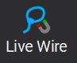

The Live Wire Tool acts as a magnetic lasso with a contour snapping to edges of objects.

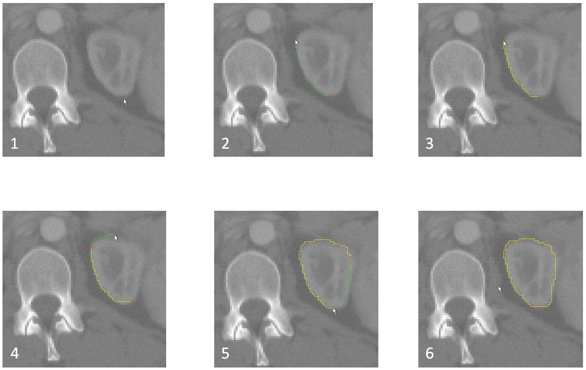

The tool handling is the same like the Lasso tool (see for more info), except it generates live wire contours instead of straight lines.

### Segment Anything Tool {#org_mitk_views_segmentationSegmentAnything}

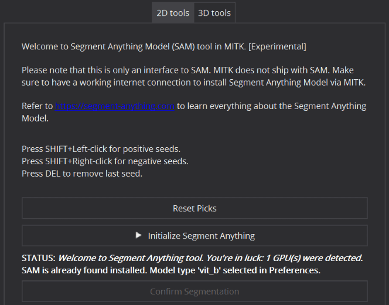

The Segment Anything Tool is a deep learning-based interactive segmentation tool. Originally created by MetaAI, MITK presents this model for medical image segmentation tasks.
The tool requires that you have Python 3 installed and available on your machine. Note: On Debian/Ubuntu systems, you need to install git, python3-pip, python3-venv package using the following command: `apt install git python3-pip python3-venv`. For best experience, your machine should be ideally equipped with a CUDA-enabled GPU.
For a detailed explanation of what this algorithm is able to, please refer to https://ai.facebook.com/research/publications/segment-anything/

Any adjustments to the [Level Window](@ref org_mitk_editors_stdmultiwidget_Levelwindow) setting impacts the segmentation. However, any applied color maps are ignored.

| **Category** | **Action** | **Shortcut** |
|--------------|------------|----------------------|
| **AI Tools (SAM/MedSAM)** | Positive click | `Shift+Left-Click` |
|  | Negative click (adjust mask) | `Shift+Right-Click` |

#### Workflow: {#org_mitk_views_segmentationSegmentAnythingWorkflow}

1. Install Segment Anything: Goto Preferences (Ctrl+P) > Segment Anything and click "Install Segment Anything with MedSAM" to install Segment Anything (version: 1.0). 
   The installation process implicitly creates a python virtual environment using the Python located in "System Python" in an MITK mainitained directory. Make sure you have a working internet connection. This might take a while. It is a one time job, though.
   Once installed, the "Install Segment Anything" button is grayed out.
   
   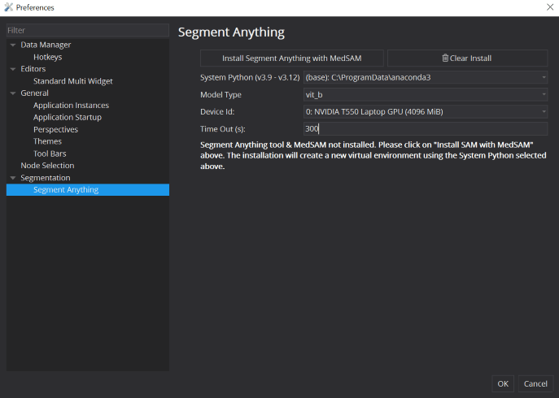

2. Note: If Python is not listed by MITK in "System Python", click "Select..." in the dropdown to choose an unlisted installation of Python. Note that, while selecting an arbitrary environment folder, only select the base folder, e.g. "/usr/bin/".
   No need to navigate all the way into "../usr/bin/python3", for example.
3. Select a specific model type in the "Model Type" dropdown. The default is "vit_b" for low memory footprint. However, more larger models "vit_l" and "vit_h" are also available for selection.
4. Select inference hardware, i.e. any GPU or CPU. This is internally equivalent to setting the **CUDA_VISIBLE_DEVICES** environment variable.
5. Click "OK" to save the preference settings.
6. Goto Segmentation View > 2D tools > Segment Anything.
7. Click "Initialize Segment Anything" to start the tool backend. This will invoke downloading of the selected model type from the internet. This might take a while. It is a one time job, though.
8. Once the tool is initialized, Press SHIFT+Left Click on any of the 3 render windows to start click guided segmentation on that slice.
9. Press SHIFT+Right Click for negative clicks to adjust the preview mask on the render window.

### MedSAM Tool {#org_mitk_views_segmentationMedSAM}

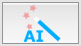

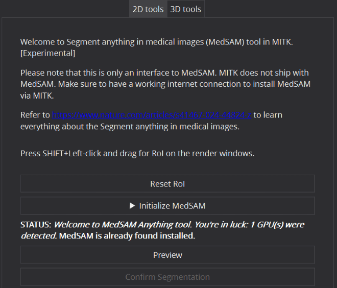

The MedSAM (Segment Anything in Medical Images) tool is a specialization of the the Segment Anything (SAM) tool. A new foundation model in the back end is dedicated to universal medical image segmentation.
Just like the Segment Anything tool, the MedSAM tool requires that you have Python 3 installed and available on your machine. Note: On Debian/Ubuntu systems, you need to install the git, python3-pip, and python3-venv packages using the following command: `sudo apt install git python3-pip python3-venv`.
For best experience, your machine should be ideally equipped with a CUDA-enabled GPU.
Any adjustments to the [Level Window](@ref org_mitk_editors_stdmultiwidget_Levelwindow) setting impacts the segmentation. However, any applied color maps are ignored.

#### Workflow {#org_mitk_views_segmentationMedSAMWorkflow}

1. Install MedSAM: Goto Preferences (Ctrl+P) > Segment Anything and click "Install Segment Anything with MedSAM" to install Segment Anything (version: 1.0) & MedSAM tool backends together. 
   The installation process implicitly creates a python virtual environment using the Python located in "System Python" in a directory maintained by MITK. Make sure you have a working internet connection, which might take a while. It is a one-time job, though.
   Once installed, the "Install Segment Anything with MedSAM" button is grayed out. For details, refer to the Segment Anything tool workflow.

2. Goto Segmentation View > 2D tools > MedSAM.
3. Click "Initialize MedSAM" to start the tool. This will start downloading the model weights from the internet first, if not done before. This might take a while. It is a one-time job, though.
4. Once the tool is initialized, press Shift+Left Click on any of the render windows to create a bounding box for that image slice.
5. Click on the anchor points of the bounding box to adjust the region of interest.
6. Click on Preview to generate segmentation from MedSAM model.

Note: For a detailed explanation of what this algorithm is able to, please refer to https://www.nature.com/articles/s41467-024-44824-z

### MONAI Label 2D Tool {#org_mitk_views_segmentationMonaiLabel2D}

Read more about the tool here at [MONAI Label 3D Tool](@ref org_mitk_views_segmentationMonaiLabel3D)

### Selection tool {#org_mitk_views_segmentationselectiontool}

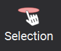

The Selection tool allows you to identify and select labels directly in the 2D render views. When the tool is active, hovering over labels highlights them and displays a popup near the mouse cursor showing useful information such as name, color, pixel value, and anatomical region (if defined).

If multiple labels from different groups overlap at the mouse position, all of them will be highlighted simultaneously (unless the "Check only active group" option is enabled).

The tool provides a **Check only active group** option. When enabled, only labels belonging to the same group as the currently active label will be highlighted by the mouse cursor.

**Left-click** to select the topmost highlighted label instance in the label manager and make it the active label.

### 2D and 3D Interpolation {#org_mitk_views_segmentationinterpolation}

Creating segmentations using 2D manual contouring for large image volumes may be very time-consuming, because structures of interest may cover a large range of slices.
The segmentation view offers two helpful features to mitigate this drawback:

- 2D Interpolation
- 3D Interpolation

The **2D Interpolation** creates suggestions for a segmentation whenever you have a slice that

- has got neighboring slices with segmentations (these do not need to be direct neighbors but could also be a couple of slices away) AND
- is completely clear of a manual segmentation, i.e. there will be no suggestion if there is even only a single pixel of segmentation in the current slice.

Interpolated suggestions are displayed in a different way than manual segmentations are, until you "accept" them as part of the segmentation.
To accept single slices, click the "Accept" button below the toolbox.
Once you are happy with the interpolations between two neighboring slices, navigate to one of the two parent slices (the ones that you did the manual contouring on) and click the 'Accept all interpolations' button (see above).

The **3D interpolation** creates suggestions for 3D segmentations. That means if you start contouring, from the second contour onwards, the surface of the segmented area will be interpolated based on the given contour information.
The interpolation works with all available manual tools. Please note that this is currently a pure mathematical interpolation, i.e. image intensity information is not taken into account.
With each further contour the interpolation result will be improved, but the more contours you provide the longer the recalculation will take.
To achieve an optimal interpolation result and in this way a most accurate segmentation you should try to describe the surface with sparse contours by segmenting in arbitrary
oriented planes. The 3D interpolation is not meant to be used for parallel slice-wise segmentation, but rather segmentations in i.e. the axial, coronal and sagittal plane.

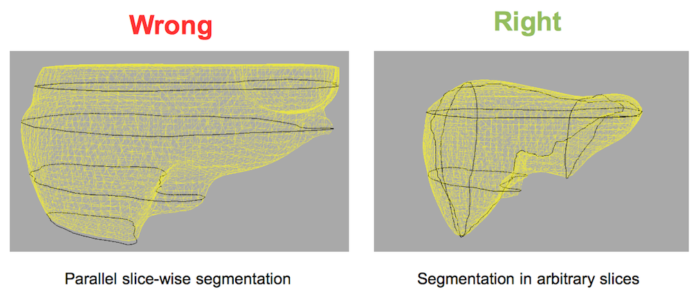

You can accept the interpolation result by clicking the *Confirm*-button below the tool buttons.
In this case the 3D interpolation will be deactivated automatically so that the result can be post-processed without any interpolation running in the background.

Additional to the surface, black contours are shown in the 3D render window, which mark all the drawn contours used for the interpolation.
You can navigate between the drawn contours by clicking on the corresponding *position* nodes in the data manager which are stored as sub-nodes of the selected segmentation.
If you do not want to see these nodes just uncheck the *Show Position Nodes* checkbox and these nodes will be hidden.

If you want to delete a drawn contour we recommend to use the Erase-Tool since undo / redo is not yet working for 3D interpolation.
The current state of the 3D interpolation can be saved across application restart. For that, just click on save project during the interpolation is active.
After restarting the application and load your project you can click on "Reinit Interpolation" within the 3D interpolation GUI area.

## 3D segmentation tools {#org_mitk_views_segmentation3dsegmentation}

The 3D tools operate on the whole image and require usually a small amount of interaction like placing seed-points or specifying certain parameters. All 3D tools provide
an immediate segmentation feedback, which is displayed as a transparent green overlay. For accepting a preview you have to press the *Confirm* button of the selected tool.
The following 3D tools are available:

### 3D Threshold tool {#org_mitk_views_segmentation3dthresholdtool}

The thresholding tool simply applies a 3D threshold to the patient image. All pixels with values equal or above the selected threshold are labeled as part of the segmentation.
You can change the threshold by either moving the slider of setting a certain value in the spinbox.

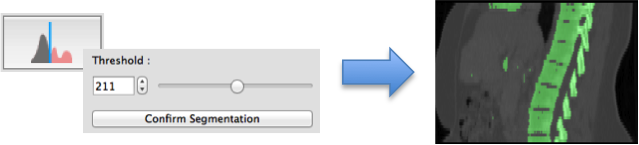

### 3D upper / lower threshold tool {#org_mitk_views_segmentation3dulthresholdTool}

The Upper/Lower Thresholding tool works similar to the simple 3D threshold tool but allows you to define an upper and lower threshold. All pixels with
values within this threshold interval will be labeled as part of the segmentation.

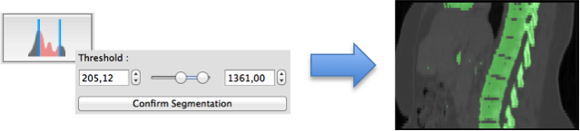

### 3D Otsu tool {#org_mitk_views_segmentation3dotsutool}

The 3D Otsu tool provides a more sophisticated thresholding algorithm. It allows you to define a number of regions. Based on the image histogram the pixels will
then be divided into different regions. The more regions you define the longer the calculation will take. You can select afterwards which of these regions you want to confirm as segmentation.

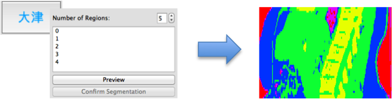

### 3D GrowCut tool {#org_mitk_views_segmentation3dgrowcuttool}

The 3D GrowCut tool uses previously created segmentation labels (e.g. by the "Add"-tool) stored in the segmentation layer 0.
The GrowCut tool will use these segmentation labels to create a seedimage that will serve as input to the algorithm.
As an advanced setting option, a Distance penalty can be set, which increases the cohesion in the immediate surroundings of the initial labels.
Based on the seedimage and the Distance penalty, a growing is started, which includes all areas that are not initially assigned to a specific label.
During this process, initially unassigned areas are assigned to the best fitting labels.
After the segmentation process, the user can decide which newly generated labels should be confirmed.

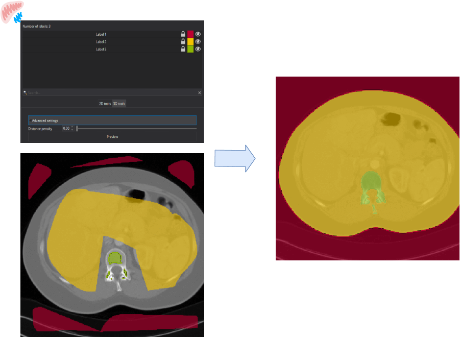

### Picking Tool {#org_mitk_views_segmentationpickingtool}

The Picking tool offers two modes that allow you to manipulate "islands" within your segmentation. This is especially useful if e.g. a thresholding provided you with several areas within
your image but you are just interested in one special region.

- **Picking mode:** Allows you to select certain "islands". When the pick is confirmed, the complete content of the active label will be removed except the pick. This mode is beneficial if you have a lot segmentation noise and want to pick the relevant parts and dismiss the rest. Hint: You can also pick from other labels, but this will only work if these labels are unlocked.
- **Relabel mode:** Allows you to select certain "islands". When the pick is confirmed, it will be relabeled and added to the active label content. Hint: This mode ignores the locks of other labels, hence you do not need to unlock them explicitly.

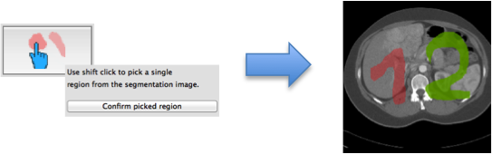

### nnU-Net Tool (Ubuntu only) {#org_mitk_views_segmentationnnUNetTool}

This tool provides a GUI to the deep learning-based segmentation algorithm called the nnU-Net v1. With this tool, you can get a segmentation mask predicted for the loaded image in MITK. Be ready with the pre-trained weights (a.k.a **RESULTS_FOLDER**)
for your organ or task concerned, before using the tool. For a detailed explanation of the parameters and pre-trained weights folder structure etc., please refer to https://github.com/MIC-DKFZ/nnUNet.

**Remark:** The tool assumes that you have a Python3 environment with nnU-Net v1 (pip) installed. Your machine should be also equipped with a CUDA enabled GPU.

#### Workflow: {#org_mitk_views_segmentationnnUNetToolWorkflow}

1. Select the "Python Path" drop-down to see if MITK has automatically detected other Python environments.
   Click on a fitting environment for the nnUNet inference or click "Select" in the dropdown to choose an unlisted python environment. Note that, while selecting an arbitrary environment folder, only select the base folder, e.g. "myenv".
   No need to select all the way until "../myenv/bin/python", for example.
2. Click on the "nnUNet Results Folder" directory icon to navigate to the results folder on your hard disk. This is equivalent to setting the **RESULTS_FOLDER** environment variable. If your results folder is as
   per the nnUNet required folder structure, the configuration, trainers, tasks and folds are automatically parsed and correspondingly loaded in the drop-down boxes as shown below. Note that MITK automatically checks for the
   **RESULTS_FOLDER** environment variable value and, if found, auto parses that directory when the tool is started.
   
   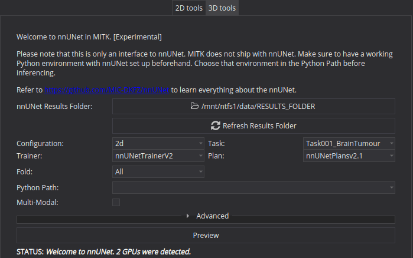

3. Choose your required Task-Configuration-Trainer-Planner-Fold parameters, sequentially. By default, all entries are selected inside the "Fold" dropdown (shown: "All").
   Note that, even if you uncheck all entries from the "Fold" dropdown (shown: "None"), then too, all folds would be considered for inferencing.
4. For ensemble predictions, you will get the option to select parameters irrespective on postprocessing files available in the ensembles folder of **RESULTS_FOLDER**.
   Note that, if a postprocessing json file exists for the selected combination then it will used for ensembling, by default. To choose not to, uncheck the "Use PostProcessing JSON" in the "Advanced" section.
   
   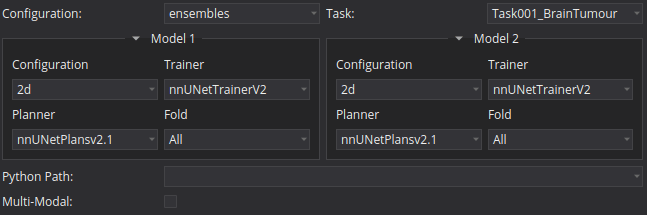

5. If your task is trained with multi-modal inputs, then "Multi-Modal" checkbox is checked and the no.of modalities are preloaded and shown next to "Required Modalities".
   Instantly, as much node selectors with corresponding modality names should appear below to select the Data Manager along including a selector with preselected with the reference node.
   Now, select the image nodes in the node selectors accordingly for accurate inferencing.
   
   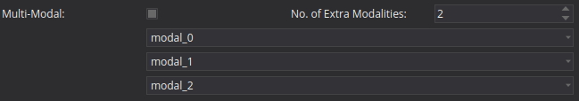

6. Click on "Preview".
7. In the "Advanced" section, you can also activate other options like "Mixed Precision" and "Enable Mirroring" (for test time data augmentation) pertaining to nnUNet.
   
   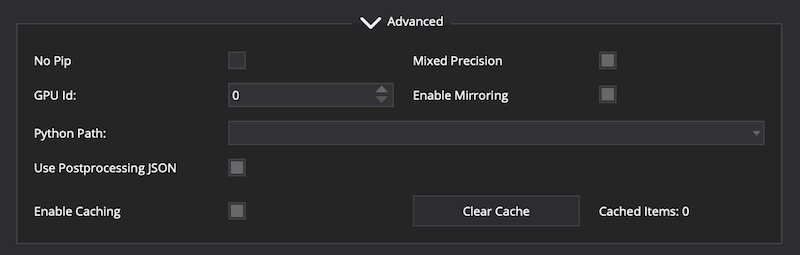

8. Use "Advanced" > "GPU Id" combobox to change the preferred GPU for inferencing. This is internally equivalent to setting the **CUDA_VISIBLE_DEVICES** environment variable.
9. Every inferred segmentation is cached to prevent a redundant computation. In case, a user doesn't wish to cache a Preview, uncheck the "Enable Caching" in the "Advanced" section. This will ensure that the
   current parameters will neither be checked against the existing cache nor a segmentation be loaded from it when Preview is clicked.
10. You may always clear all the cached segmentations by clicking "Clear Cache" button.

#### Miscellaneous: {#org_mitk_views_segmentationnnUNetToolMisc}

- In case you want to reload/reparse the folders in the "nnUNet Results Folder", eg. after adding new tasks into it, you may do so without reselecting the folder again by clicking the "Refresh Results Folder" button.
- The "Advanced" > "GPU Id" combobox lists the Nvidia GPUs available by parsing the `nvidia-smi` utility output. In case your machine has Nvidia CUDA enabled GPUs but the `nvidia-smi` fails for some reason, the "GPU Id" combobox will show no entries.
  In such a situation, it's still possible to execute inferencing by manually entering the preferred GPU Id, eg. 0 in the combobox.
- The "Advanced" > "Available Models" lists the available pre-trained tasks for download. Make sure you have internet connection. Then, choose a Task from the dropdown and click the Download button. The pre-trained models for the selected Task
  will be downloaded and placed to the **RESULTS_FOLDER** directory automatically.
- In the **RESULTS_FOLDER** directory, inside the trainer-planner folder of every task, MITK keeps a "mitk_export.json" file for fast loading for multi-modal information. It is recommended not to delete this file(s) for a fast responsive UI.
  Tip: If multi-modal information shown on MITK is not correct for a given task, you may modify this JSON file and try again.

### TotalSegmentator Tool {#org_mitk_views_segmentationTotalSegmentator}

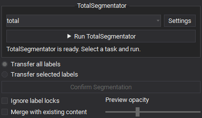

This tool provides a GUI to the deep learning-based segmentation algorithm called the TotalSegmentator (v2). With this tool, you can get a segmentation mask predicted for 117 classes in CT images, loaded in MITK.
For a detailed explanation on tasks and supported classes etc., please refer to https://github.com/wasserth/TotalSegmentator

The tool assumes that you have Python >= 3.9 installed and available on your machine. We recommend to install TotalSegmentator via MITK. The "Install TotalSegmentator" action implicitly creates a python virtual environment in an MITK mainitained
directory. Note: on Debian/Ubuntu systems, you need to install the python3-venv package using the following command: `apt install python3-venv`. For best results, your machine should be ideally equipped with a CUDA-enabled GPU.

#### Workflow: {#org_mitk_views_segmentationTotalSegmentatorWorkflow}

1. Install TotalSegmentator: Goto Preferences (Ctrl+P) > TotalSegmentator and click "Install TotalSegmentator" to install TotalSegmentator (version: 2.9.0) in a virtual environment. Make sure you have a working internet connection. This might take a while. It is a one time job, though.
   
   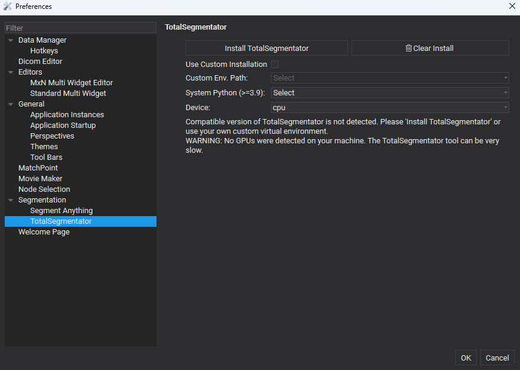

2. A new dialog window will open up, showing a detailed log. When the donwload is done, the "Close" button will be enabled and you may close the window.
3. Note: If Python is not listed by MITK in "System Python Path", click "Select..." in the dropdown to choose an unlisted installation of Python and try downloading again. 
   Note that, while selecting an arbitrary environment folder, only select the base folder, e.g. "/usr/bin/".
   No need to navigate all the way into "../usr/bin/python3", for example.
4. Once installed, the "Install TotalSegmentator" button is grayed out.
5. In case you want to use your own virtual environment containing TotalSegmentator check the "Use Custom Installation" checkbox. Then, select the environment of your choice by using "Custom Env. Path" > "Select...".
6. Select the preferred device for inferencing in the "Device" combobox. This is internally equivalent to setting the **CUDA_VISIBLE_DEVICES** environment variable.
7. Click "OK" to save the preference settings.
8. Goto Segmentation View > 3D tools > TotalSegmentator.
9. Select a specific subtask in the "Tasks" drop-downs. The default is "total" for non-specific total segmentation.
10. Click on "Run TotalSegmentator" for a preview.
11. You can also activate other options like "Fast" for faster runtime and less memory requirements. Use "Fast" if you only have a CPU for inferencing.

### MONAI Label 3D Tool {#org_mitk_views_segmentationMonaiLabel3D}

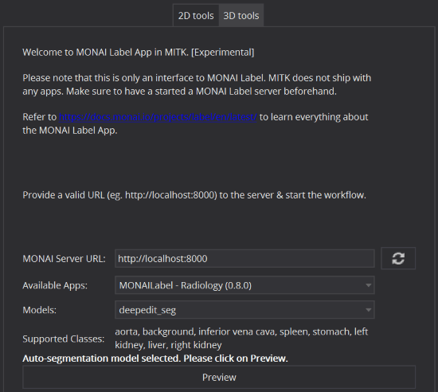

MONAI Label is a server-client system that facilitates interactive medical image annotation by using AI. MONAI Label typically hosts different "Apps", e.g. Radiology or Pathology. Each App hosts a set of pretrained models on pertaining datasets.
MITK is tested for the Radiology app and only supports auto and click-based "deepgrow" models. For internal reasons, MITK doesn't support "deepedit" and "localization_spine" models specifically.
The tool requires that you have a URL to a (self-) hosted MONAI Label server.
For a detailed explanation of what MONAI Label is capable of, please refer to https://docs.monai.io/projects/label/en/latest/.

Any adjustments to the [Level Window](@ref org_mitk_editors_stdmultiwidget_Levelwindow) setting impacts the segmentation. However, any applied color maps are ignored.

#### Workflow: {#org_mitk_views_segmentationMonaiLabelWorkflow}

1. Enter your URL in the "MONAI Server URL" box and press the refresh button next to it. This connects MITK to the MONAI Label server and fetches exposed metadata.
2. Select the Radiology app e.g. from the "Available Apps" combobox. This will load all supported model names in the "Models" combo box below it.
3. From the "Models" box select the model you want to use. Immediately, all supported classes of the model on which the model was trained will be shown below it.
4. If an interactive model is selected e.g. "deepgrow_3d", Press and hold SHIFT and left click on any of the 3 render windows to start click guided segmentation.
   Press SHIFT+Right click for negative clicks to adjust the preview mask on the render window.
5. If an auto-segmentation model is selected e.g. "deepedit_seg", simply click "Preview" for generating masks.
6. If you see that segmentation preview is not shown on the Workbench (ending up showing error) yet, your MONAI Label server terminal shows successful completion of the inference request then go to Preferences (Ctrl+P) > Segmentation
   and change the MONAI Label time out value (in seconds).

## Additional things you can do with segmentations {#org_mitk_views_segmentationpostprocessing}

Segmentations are never an end in themselves. Consequently, the segmentation view adds a couple of "post-processing" actions, accessible through the context-menu of the data manager.

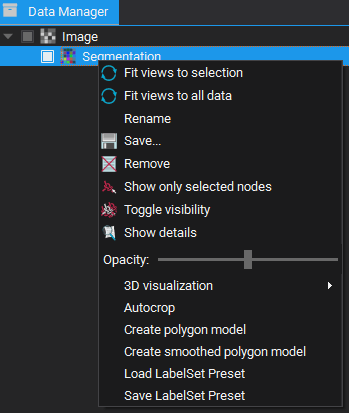

- **Create polygon model** applies the marching cubes algorithm to the segmentation. This polygon model can be used for visualization in 3D or other applications such as stereolithography (3D printing).
- **Create smoothed polygon model** uses smoothing in addition to the marching cubes algorithm, which creates models that do not follow the exact outlines of the segmentation, but look smoother.
- **Autocrop** can save memory. Manual segmentations have the same extent as the patient image, even if the segmentation comprises only a small sub-volume. This invisible and meaningless margin is removed by autocropping.

## Segmentation of 3D+t images {#org_mitk_views_segmentationof3dtimages}

For segmentation of 3D+t images, some tools give you the option to choose between creating dynamic and static masks.

- Dynamic masks can be created on each time frame individually.
- Static masks will be defined on one time frame and will be the same for all other time frames.

In general, segmentation is applied on the time frame that is selected when execution is performed.
If you alter the time frame, the segmentation preview is adapted.
